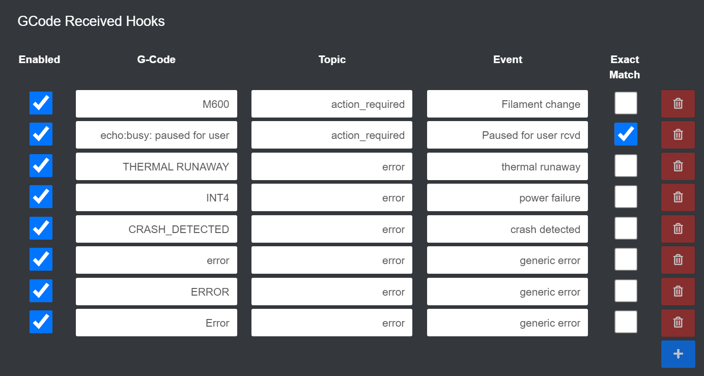

# OctoPrint-Custom_gcode_events

This plugin enables you to configure G-Code hooks (sent or received) that will fire custom events which can then be picked up by another plugin, such as [OctoPrint-MQTT](https://github.com/OctoPrint/OctoPrint-MQTT).

My usecases are mostly to be notified through Home Assistant notifications when my printer requires some attention.
```GCode received --> Fire event --> OctoPrint-MQTT: Translate event to MQTT --> Home Assistant: Automation is triggered that notifies me.```


## Setup

Install via the bundled [Plugin Manager](https://docs.octoprint.org/en/master/bundledplugins/pluginmanager.html)
or manually using this URL:

    https://github.com/RoboMagus/OctoPrint-Custom_gcode_events/archive/master.zip

## Configuration

The plugins GCode hooks are split up into _Send_ and _Receive_ hooks.

The _Send_ hooks can be used to fire an event when a GCode command has been sent to the 3D printer. This can be usefull for e.g. `M117` GCode commands that are used to set a message on the 3D printers LCD. Or with `M600` / `M601` when the printer is paused for user interaction.

The _Receive_ hooks can be used to fire an event based on serial data received from your 3D printer. For example, when the print is paused a Prusa MK3 will emit ```echo:busy: paused for user```. This can be entered in the __G-Code__ field to fire an event whenever this string is received[^1]. In the __Topic__ field enter the name as wich the event should be fired. Note that this will be prepended with `gcode_event_`, converted to lower-case and spaces will be removed! E.g. a topic field entry of `Action Required` will fire an event named `gcode_event_action_required`. In the __Event__ field you may enter additional identifying information. This is an optional field that may be usefull when multiple different GCode hooks are used to fire the same event.

For example, my settings shown in the image below fire either an `error`, or `action_required` event based on the GCode received from the 3D printer. The additional information in the __Event__ field is then used by in my case Home Assistant to determine what notification should be announced.




[^1]: These ```echo:busy``` lines are repeated every 2 seconds or so on the Prusa printers. To avoid spamming the notification interface a timer is used to only fire an event if the G-Code trigger was not received in the last 5 seconds.
